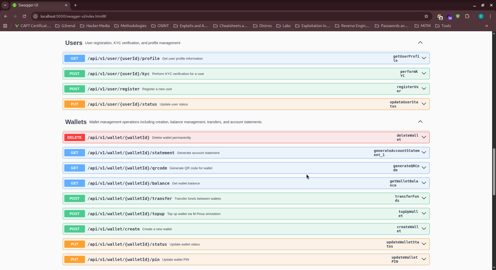
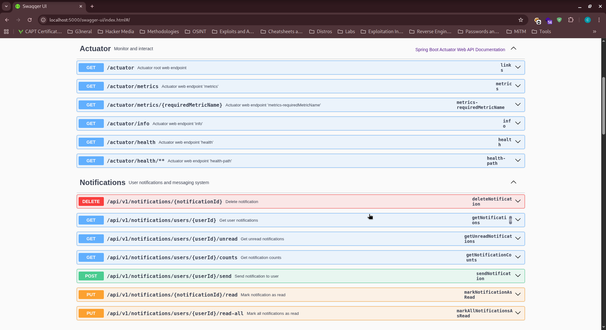
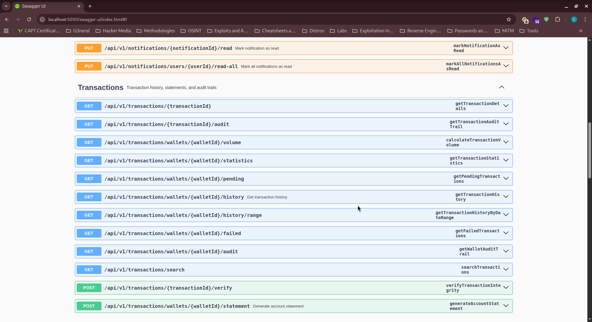

<div align="center">

# Digital Wallet API

</div>

<div align="center">


[Quick Start](#-quick-start) • [Documentation](#-api-documentation) • [Configuration](#-configuration) • [Postman Collection](#-postman-collection)

</div>

---

## Overview

Financial services platform designed to power modern fintech applications, digital banking solutions, and financial inclusion initiatives. Built with Spring Boot and following industry best practices, it provides a complete suite of financial operations with robust security, comprehensive audit trails, and real-time notifications.

---

## Key Features

### **Financial Operations**
- **Account Creation**: Register and create an account in the digital wallet system
- **Wallet Management**: Create, activate, suspend, and delete digital wallets
- **Multi-Currency Support**: KES (Kenyan Shilling) with extensible currency framework
- **Transaction Types**: Deposits, withdrawals, transfers, refunds, fees, bonuses
- **M-Pesa Integration**: Simulated mobile money top-ups and withdrawals
- **QR Code Payments**: Generate and scan QR codes for instant payments

### **Advanced Analytics**
- **Real-time Balance Tracking**: Instant balance updates and notifications
- **Transaction History**: Comprehensive audit trails with search and filtering
- **Account Statements**: PDF, JSON, and CSV export formats
- **Financial Reporting**: Transaction statistics and volume analytics
- **Compliance**: Built-in audit logging for regulatory requirements

### **Enterprise Security**
- **Multi-Factor Authentication**: OTP verification via SMS, Email, and Push notifications
- **Advanced Encryption**: SHA-256 password hashing with salt
- **Rate Limiting**: Configurable API rate limiting to prevent abuse
- **Security Monitoring**: Real-time fraud detection and suspicious activity tracking
- **Audit Trails**: Comprehensive logging of all financial operations

### **Smart Notifications**
- **Multi-Channel Delivery**: SMS, Email, Push, and In-App notifications
- **Template System**: Customizable notification templates
- **Delivery Tracking**: Real-time notification status monitoring
- **Retry Logic**: Automatic retry for failed deliveries
- **User Preferences**: Channel-specific notification settings

---

### Real-World Applications

**Banking as a Service (BaaS)**
- Enable traditional banks to offer digital wallet services
- Power neobanks and challenger banks
- Support embedded finance in e-commerce platforms
- Facilitate cross-border remittances and international transfers

**Wallet as a Service (WaaS)**
- Mobile money solutions (similar to M-Pesa, PayPal, Venmo)
- Peer-to-peer payment platforms
- Digital banking applications
- Serve unbanked populations in emerging markets

---

## Quick Start

### Prerequisites

- **Java 17+** - [Download](https://www.oracle.com/java/technologies/downloads/)
- **Maven 3.8+** - [Install Guide](https://maven.apache.org/install.html)
- **MySQL 8.0+** - [Download](https://dev.mysql.com/downloads/)
- **Git** - [Download](https://git-scm.com/downloads)

### Installation

#### 1. Clone and Setup
```bash
# Clone the repository
git clone https://github.com/bdr0id/digital-wallet.git
cd digital-wallet

# Build the project
./mvnw clean install
```

#### 2. Database Configuration
```bash
# Create MySQL database
mysql -u root -p
CREATE DATABASE wallet_dev;
CREATE DATABASE wallet_prod;
```

**Environment Variables:**
```env
# Database Configuration
DB_HOST=localhost
DB_PORT=3306
DB_NAME=wallet_dev
DB_USERNAME=root
DB_PASSWORD=your_password

# Gmail SMTP Configuration
GMAIL_USERNAME=your-email@gmail.com
GMAIL_APP_PASSWORD=your-app-password

# Application Settings
SERVER_PORT=5000
SPRING_PROFILES_ACTIVE=dev
```

#### 3. Run the Application
```bash
# Development mode (with hot reload)
./mvnw spring-boot:run

# Production mode
./mvnw spring-boot:run -Dspring-boot.run.profiles=prod

# With custom JVM settings
./mvnw spring-boot:run -Dspring-boot.run.jvmArguments="-Xmx2g -Xms1g"
```

#### 4. Verify Installation
```bash
# Health check
curl http://localhost:5000/actuator/health

# API documentation
open http://localhost:5000/swagger-ui.html
```

## Configuration

### **Environment Profiles**

#### Development Profile (`application-dev.yml`)
```yaml
# Optimized for development with:
- Hot reload enabled
- Verbose logging (DEBUG level)
- Database recreation on startup
- Relaxed security settings
- Enhanced Swagger UI
```

#### Production Profile (`application-prod.yml`)
```yaml
# Production-ready configuration:
- Optimized performance settings
- Security hardening
- Database connection pooling
- Comprehensive monitoring
- Audit logging enabled
```

### **Database Configuration**

**HikariCP Connection Pool:**
```yaml
spring:
  datasource:
    hikari:
      maximum-pool-size: 20
      minimum-idle: 5
      connection-timeout: 20000
      idle-timeout: 300000
      max-lifetime: 1200000
```

### **Email Configuration**

**Gmail SMTP Setup:**
```yaml
spring:
  mail:
    host: smtp.gmail.com
    port: 587
    username: ${GMAIL_USERNAME}
    password: ${GMAIL_APP_PASSWORD}
    properties:
      mail:
        smtp:
          auth: true
          starttls:
            enable: true
```

**Security Note:** Use App Passwords for Gmail accounts with 2FA enabled.

---

## API Documentation

### 🔗 **Access Points**
- **Swagger UI**: `http://localhost:5000/swagger-ui.html`
- **OpenAPI Spec**: `http://localhost:5000/v3/api-docs`
- **Health Check**: `http://localhost:5000/actuator/health`

### **Core Endpoints**

<div align="center">
  
  
  
</div>

#### **User Management**
```http
POST   /api/v1/user/register              # User registration
POST   /api/v1/user/{id}/kyc              # KYC verification
GET    /api/v1/user/{id}/profile          # User profile
PUT    /api/v1/user/{id}/status           # Update user status
```

#### **Wallet Operations**
```http
POST   /api/v1/wallet/create              # Create wallet
GET    /api/v1/wallet/{id}/balance        # Check balance
POST   /api/v1/wallet/{id}/topup          # Add funds
POST   /api/v1/wallet/{id}/transfer       # Transfer money
GET    /api/v1/wallet/{id}/statement      # Account statement
GET    /api/v1/wallet/{id}/qrcode         # Generate QR code
PUT    /api/v1/wallet/{id}/pin            # Update PIN
PUT    /api/v1/wallet/{id}/status         # Update status
DELETE /api/v1/wallet/{id}                # Delete wallet
```

#### **Transaction Management**
```http
GET    /api/v1/transactions/wallets/{id}/history    # Transaction history
GET    /api/v1/transactions/{id}                     # Transaction details
GET    /api/v1/transactions/search                   # Search transactions
GET    /api/v1/transactions/wallets/{id}/statistics  # Transaction analytics
```

#### **Notifications**
```http
POST   /api/v1/notifications/send         # Send notification
GET    /api/v1/notifications/{userId}    # Get notifications
PUT    /api/v1/notifications/{id}/read   # Mark as read
```

### **Authentication Flow**

**OTP-Based Security:**
1. **Request Operation**: User initiates sensitive operation
2. **OTP Generation**: System generates 6-digit OTP
3. **Multi-Channel Delivery**: OTP sent via SMS, Email, Push
4. **Verification**: User submits OTP with request
5. **Operation Execution**: System processes verified request

---

## Postman Collection

### **Quick API Testing**

**Import Collection:**
```bash
# Download the Postman collection
curl -o Digital_Wallet_API.postman_collection.json \
  https://raw.githubusercontent.com/bdr0id/digital-wallet/main/postman/Digital_Wallet.postman_collection.json
```

**Collection Features:**
- **Complete API Coverage**: All endpoints with examples
- **Environment Variables**: Pre-configured for dev/prod
- **Test Scripts**: Automated response validation
- **User Journeys**: End-to-end workflow tests
- **Error Scenarios**: Comprehensive error handling examples

---

### **Technology Stack**

| Component | Technology | Purpose |
|-----------|------------|---------|
| **Backend** | Spring Boot 3.x | Application framework |
| **Database** | MySQL 8.0+ | Primary data storage |
| **Cache** | Redis (Optional) | Session and rate limiting |
| **Security** | Spring Security | Authentication & authorization |
| **Documentation** | OpenAPI 3.0 | API specification |
| **Monitoring** | Spring Actuator | Health checks and metrics |
| **Testing** | JUnit 5, Mockito | Unit and integration tests |

---

## Deployment

### **Docker Deployment**

```dockerfile
# Dockerfile
FROM openjdk:21-jdk-slim
COPY target/wallet-*.jar app.jar
EXPOSE 5000
ENTRYPOINT ["java", "-jar", "/app.jar"]
```

```bash
# Build and run
docker build -t digital-wallet .
docker run -p 5000:5000 digital-wallet
```

### ☁**Cloud Deployment**

**AWS Deployment:**
```bash
# Using AWS Elastic Beanstalk
eb init digital-wallet
eb create production
eb deploy
```

**Kubernetes Deployment:**
```yaml
apiVersion: apps/v1
kind: Deployment
metadata:
  name: digital-wallet
spec:
  replicas: 3
  selector:
    matchLabels:
      app: digital-wallet
  template:
    metadata:
      labels:
        app: digital-wallet
    spec:
      containers:
      - name: digital-wallet
        image: digital-wallet:latest
        ports:
        - containerPort: 5000
```

---

## Testing

### **Test Coverage**

```bash
# Run all tests
./mvnw test

# Run with coverage
.mvnw/ jacoco:report

# Integration tests
./mvnw verify

# Performance tests
./mvnw gatling:test
```

**Test Categories:**
- ✅ **Unit Tests**: Service layer and business logic
- ✅ **Integration Tests**: API endpoints and database
- ✅ **Security Tests**: Authentication and authorization
- ✅ **Performance Tests**: Load and stress testing

---

## Monitoring

### **Health Checks**

```bash
# Application health
curl http://localhost:5000/actuator/health

# Detailed health info
curl http://localhost:5000/actuator/health/db
curl http://localhost:5000/actuator/health/diskSpace
```

### **Metrics & Logging**

**Application Metrics:**
- Transaction volume and success rates
- API response times and error rates
- Database connection pool status
- Memory and CPU utilization

**Log Files:**
- `logs/wallet-application.log` - Application logs
- `logs/wallet-transactions.log` - Transaction audit trail
- `logs/wallet-security.log` - Security events
- `logs/wallet-errors.log` - Error tracking

---

## Contributing

### **Development Setup**

```bash
# Fork and clone
git clone https://github.com/your-username/digital-wallet.git
cd wallet

# Create feature branch
git checkout -b feature/amazing-feature

# Make changes and test
./mvnw test

# Commit changes
git commit -m "Add amazing feature"

# Push and create PR
git push origin feature/amazing-feature
```

### **Contribution Guidelines**

1. **Code Style**: Follow Java conventions and Spring Boot best practices
2. **Testing**: Write tests for new features and bug fixes
3. **Documentation**: Update README and API documentation
4. **Security**: Follow security best practices for financial applications
5. **Performance**: Consider performance implications of changes

---

## License

This project is licensed under the **MIT License** - see the [LICENSE](LICENSE) file for details.

---

## Support

### **Getting Help**

- **Documentation**: [API Documentation](http://localhost:5000/swagger-ui.html)
- **Issues**: [GitHub Issues](https://github.com/bdr0id/digital-wallet/issues)
- **Discussions**: [GitHub Discussions](https://github.com/bdr0id/digital-wallet/discussions)
- **Email**: collinskboit@gmail.com

### **Troubleshooting**

**Common Issues:**

1. **Database Connection Failed**
   ```bash
   # Check MySQL service
   sudo systemctl status mysql
   
   # Verify database exists
   mysql -u root -p -e "SHOW DATABASES;"
   ```

2. **Port Already in Use**
   ```bash
   # Find process using port 5000
   lsof -i :5000
   
   # Kill process
   kill -9 <PID>
   ```

3. **Email Not Sending**
   ```bash
   # Check Gmail credentials
   # Ensure App Password is used (not regular password)
   # Verify 2FA is enabled on Gmail account
   ```

---

<div align="center">

**Built with ❤️ for the future of digital finance**

[Star this repo](https://github.com/bdr0id/digital-wallet) • [Report Bug](https://github.com/bdr0id/digital-wallet/issues) • [Request Feature](https://github.com/bdr0id/digital-wallet/issues)

</div>